# 🏢 Awesome-Rental-Property-Management

  

  
  
  
  
  
  

## 🌟 Curated Rental Property Management Software & Systems Directory

> 🚀 **The definitive, community-driven ecosystem of commercial SaaS platforms and open-source GitHub projects for residential rental property management, tenant portals, digital leases, automated rent collection, maintenance dispatch, and trust accounting.**

📅 **Last updated: September 2026**

---

### 🔍 Overview & Core Capabilities

Whether you are an independent DIY landlord with a single-family duplex, a growing multifamily property manager, or a real estate enterprise scaling thousands of units, choosing the right **Rental Property Management Software (PMS)** is critical. Modern systems unify:

- 🏢 **Portfolio & Unit Tracking:** Centralize property addresses, unit amenities, vacancy status, and occupancy history.
- 🔑 **Tenant Screening & Leasing:** Digital applications, credit/criminal/eviction background checks, and lawyer-reviewed e-signed leases.
- 💳 **Automated Rent Collection:** Online tenant portals supporting recurring ACH transfers, debit/credit cards, and automated late fees.
- 🛠️ **Maintenance & Work Orders:** 24/7 tenant repair ticketing, contractor dispatch, before/after photo documentation, and invoice tracking.
- 📊 **Real Estate Accounting & Taxes:** Trust accounting, owner draw disbursements, automated 1099 generation, bank reconciliations, and cash-flow reporting.

---

## 📑 Table of Contents

- [☁️ SaaS & Hosted Platforms](#saas-hosted-platforms)
- [🔓 Open-Source GitHub Projects](#open-source-github-projects)
- [💡 Architectural Guidelines & Custom Stacks](#architectural-guidelines)
- [📈 Star History](#star-history)
- [🤝 How to Contribute](#how-to-contribute)
- [⚖️ Disclaimer](#disclaimer)

---

## ☁️ SaaS & Hosted Platforms 

> 📊 **Market Overview & Industry Structure:** The global rental property management software market is currently estimated at **$2.4B – $3.2B** (projected to surpass **$5B+ by 2034** at a 7–9% CAGR; broader real estate PMS ecosystem ~$10B–$15B). The industry is **moderately fragmented** rather than a winner-take-all monopoly: while an established tier of enterprise incumbents (RealPage, Yardi Systems, AppFolio) captures the institutional segment (~34% top-3 market share), intense fragmentation persists across independent landlords, mid-market portfolios, and modern cloud challengers.

| 🏢 Platform | 🏛️ Company Size (Valuation / Revenue) | 🎯 Description / Core Focus | 💰 Pricing (Starting Tier) | 🆓 Free Tier / Free Trial Limits |
| :--- | :--- | :--- | :--- | :--- |
| **[Avail (by Realtor.com)](https://www.avail.co/)** | **~$16B+ Market Cap** (Parent: News Corp / Move, Inc.; ~$650M division revenue) | Landlord-focused platform offering listing syndication, tenant screening, rent collection, and lease tools, popular with DIY portfolios. | **$0/month** (Unlimited plan); **$9/unit/month** (Unlimited Plus plan for waived tenant ACH fees, FastPay next-day rent, and custom leases) | **Free forever "Unlimited" plan** with unlimited units, listings syndication, standard leases, and maintenance tracking ($2.50 ACH fee per transaction paid by tenant) |
| **[Buildium](https://www.buildium.com/)** | **$10.2B Valuation** (Parent: RealPage / Thoma Bravo; acquired for $580M; ~$1.1B parent revenue) | Popular residential property management platform with strong accounting, leasing, tenant portals, and scalable plans for growing portfolios. | Starts at **$62/month** (Essential plan, covers up to 50 units; Growth from $192/mo, Premium from $400/mo) | **14-day free trial** with full access to platform features using sample or custom data (no credit card required; no free forever plan) |
| **[Propertyware](https://www.propertyware.com/)** | **$10.2B Valuation** (Parent: RealPage / Thoma Bravo; ~$1.1B parent revenue) | Property management platform especially strong for single-family, scattered-site, and large residential portfolios. | Starts at **$1.00/unit/month** with a **$250/month minimum** fee (Basic plan; Plus from $1.50/unit with $350/mo min; Premium from $2.00/unit with $450/mo min) | No free forever plan; offers **sales-coordinated limited-access free test drive / trial** (no credit card required, duration set upon consultation) and live guided demos |
| **[Yardi Breeze](https://www.yardi.com/products/yardi-breeze/)** | **~$10B+ Valuation** (Parent: Yardi Systems; ~$1.6B–$1.8B annual revenue) | Streamlined cloud property management solution from Yardi aimed at smaller to mid-sized residential and mixed-use portfolios. | Starts at **$1.00/unit/month** with a **$100/month minimum** fee (Breeze standard residential; Breeze Premier starts at $2.00/unit/mo with $400/mo min) | No free forever plan or self-service free trial; offers **scheduled free live personal demos** and free onboarding/implementation (requires $100/mo minimum commitment) |
| **[AppFolio](https://www.appfolio.com/)** | **~$7.5B Market Cap** (Public: NASDAQ: APPF; ~$1.04B TTM revenue) | Feature-rich, AI-enhanced property management platform favored by professional managers for automation, marketing, and operations. | Starts at **$1.49/unit/month** with a **$298/month minimum** fee (Core plan; Plus from $3.20/unit with $960/mo min; Max from $5.00/unit with $7,500/mo min) | No free forever plan or self-service free trial; offers **scheduled free guided live product demos** and consultation (requires minimum ~50 units for Core onboarding) |
| **[DoorLoop](https://www.doorloop.com/)** | **~$500M Valuation** (Series B, $130M+ total funding; ~$35M ARR) | Modern all-in-one property management platform known for ease of use, transparent pricing, and strong mid-market features. | Starts at **$69/month** billed annually ($99/mo monthly, Starter plan for up to 20 units; +$1.50/unit thereafter; Pro from $139/mo) | No free forever plan or self-service free trial; offers **scheduled free personalized live product demos** and platform walkthroughs |
| **[Rentec Direct](https://www.rentecdirect.com/)** | **~$150M–$195M Est. Valuation** (~$14M+ annual revenue; bootstrapped & profitable) | Comprehensive property management software focused on residential portfolios with solid accounting and tenant management tools. | Starts at **$25/month** (Rentec Starter for ≤10 units; Rentec Pro from $45/mo, Rentec PM from $55/mo) | **14-day free trial** with full access to core features (no credit card required, no setup fees; no free forever plan) |
| **[Hemlane](https://www.hemlane.com/)** | **~$30M–$50M Est. Valuation** (~$12M–$15M total funding; ~$9M–$12M revenue) | Property management platform that combines software with optional full-service management and 24/7 repair coordination for landlords. | **$0/month** (Starter) or starts at **$28/month base + $2/unit/month** (Basic plan; Essential is $28/mo base + $20/unit/mo) | **Free forever "Starter" plan** limited to 1 active property and 1 synced bank account (excludes rent collection & maintenance); **14-day free trial** for paid tiers |
| **[TenantCloud](https://www.tenantcloud.com/)** | **~$25M–$35M Est. Valuation** (~$6.6M total funding; ~$6M–$13M ARR) | Cloud-based property management platform covering listings, tenant screening, accounting, and maintenance workflows. | Starts at **$15/month** billed annually ($18/mo monthly, Starter plan; Growth from $29/mo, Pro from $50/mo) | **14-day free trial** with full feature access across Starter, Growth, and Pro tiers (test with custom properties, no credit card required; no free forever plan) |
| **[Innago](https://innago.com/)** | **~$20M–$30M Est. Valuation** (~$7.7M total funding; ~$5M–$10M ARR) | Free-to-use residential property management software focused on rent collection, digital leasing, and tenant communication. | **$0/month** platform fee for landlords (optional/tenant-paid fees: $2.00 per ACH rent payment or 2.99% per card transaction; $30–$35 tenant screening) | **Free forever plan** with unlimited units, properties, tenants, digital leases, and maintenance requests (no subscription or setup fees for landlords) |

---

## 🔓 Open-Source GitHub Projects 

> 💡 **Open-Source Landscape:** While mature tenant screening integrations, automated bank feeds, and enterprise legal forms are predominantly commercial, open-source property management software offers complete data sovereignty, zero licensing fees, and full self-hosted extensibility. Below are the top open-source projects on GitHub, sorted descending by community star count:

- **[QloApps](https://github.com/Qloapps/QloApps)**   
  🏨 Comprehensive open-source Property Management System (PMS), reservation engine, and booking platform for hospitality, serviced apartments, and multi-unit rental management.

- **[Microrealestate](https://github.com/microrealestate/microrealestate)**   
  🏠 Modern, self-hosted open-source rental property management web application designed for independent landlords to automate leases, track rent payments, and generate invoices/receipts.

- **[MicroCommunity](https://github.com/java110/MicroCommunity)**   
  🏘️ Full-featured open-source Java-based property management SaaS platform supporting multi-tenant community management, property fees, owner portals, and repair orders.

- **[Property Web Builder](https://github.com/etewiah/property_web_builder)**   
  🛠️ Open-source Ruby on Rails engine for building property management platforms, rental directories, and real estate marketing sites in minutes.

- **[Condo](https://github.com/open-condo-software/condo)**   
  🏢 Modern open-source property management SaaS platform enabling property managers to handle work order tickets, resident directories, payment tracking, invoicing, and modular mini-app integrations.

- **[Movin' In](https://github.com/aelassas/movinin)**   
  📱 Full-stack rental property management platform featuring a dedicated mobile tenant application, administrative dashboard, and native Stripe & PayPal payment gateways.

- **[Online Rental Property Manager](https://github.com/bigprof-software/online-rental-property-manager)**   
  📋 Web-based property management system for independent landlords to organize portfolios, rental units, tenant profiles, rental applications, and lease tracking.

- **[OpenKos](https://github.com/senatroxx/OpenKos)**   
  🛌 Open-source property management system built for residential rentals, apartments, and boarding houses, providing automated tenant invoicing and lease scheduling.

- **[SweetHome](https://github.com/Jubilee101/SweetHome)**   
  🏡 Residential property management system focused on bridging communication, work requests, and lease administration between landlords and occupants.

- **[Property Plus](https://github.com/SonamRinzinGurung/Real-Estate-Rental-and-Tenant-Management-System)**   
  💬 Full-stack MERN real estate and rental management platform with in-app owner-tenant messaging, digital rent registration, and lease contract tracking.

- **[Utility Billing & Property Management](https://github.com/navariltd/utility-billing)**   
  ⚡ Enterprise open-source property management and utility billing application built on ERPNext for managing residential leases, submetering, and recurring rent collection.

- **[Louez](https://github.com/Synapsr/Louez)**   
  📦 Open-source Next.js/TypeScript rental platform for managing rental inventory, reservations, customer portals, and legal contract generation.

- **[LibreProperty](https://github.com/LibreProperty/LibreProperty)**   
  🌴 Open-source property management software designed for rental portfolios, unit scheduling, booking calendars, and lease management.

- **[Odoo Real Estate (OCA)](https://github.com/OCA/vertical-realestate)**   
  🧩 Official Odoo Community Association (OCA) suite of modules extending Odoo ERP with property ownership, lease accounting, and rental management capabilities.

- **[OpenProperty](https://github.com/clawnify/OpenProperty)**   
  🔐 Open-source, self-hosted property management software created as an alternative to commercial SaaS for tracking units, tenants, leases, rent collection, and maintenance work orders.

- **[ImmiQ](https://github.com/SuperLonci/ImmiQ)**   
  🧾 Lightweight property and tenant management tool helping property owners monitor rental payments, manage lease files, and track maintenance issues.

---

### 💡 Architectural Guidelines & Custom Stacks 

- 🎯 **Choosing Open vs. Commercial:** Evaluating **OpenProperty** or **Microrealestate** when full data ownership, private hosting, and custom development are top priorities.
- 🏢 **ERP Integration:** Deploying **Odoo Real Estate (OCA)** or **ERPNext Utility Billing** as a foundation for complex double-entry accounting and multi-entity corporate structures.
- 🔌 **Modular DIY Stack:** Pairing open-source rental managers with dedicated payment gateways (Stripe Connect, Plaid) and accounting suites (GnuCash, Ledger) for small-to-medium portfolios.
- ⚖️ **Compliance & Security:** Commercial platforms (Buildium, AppFolio, DoorLoop, Yardi Breeze, Propertyware, TenantCloud) remain the practical choice for professional operators requiring automated Fair Housing compliance, legal lease disclosures, automated eviction filing, and 24/7 emergency dispatch.

**🏗️ Recommended Architecture for Custom Implementations:**
> `Self-Hosted Engine (Microrealestate / OpenProperty)` ➔ `Portfolio & Lease Tracking` ➔ `Payment Webhook (Stripe/ACH)` ➔ `Work-Order Dispatch Queue` ➔ `Owner Financial Statements`

---

## 📈 Star History 

---

## 🤝 How to Contribute 

1. 🍴 **Fork the repository.**
2. 📝 **Add or edit entries in `README.md`** (follow the existing table/list structure).
3. 🔗 **Include:** Name, official link, 1–2 sentence factual description, pricing, and GitHub Stars_Badge (for open-source tools).
4. 🚀 **Submit a Pull Request (PR)** with a clear, concise summary of changes.

⭐ **Star this repository if you find it helpful!**

---

## ⚖️ Disclaimer 

- ⚠️ This is a **community-curated index** — provided for informational purposes only, not an endorsement.
- 🛡️ Property management involves legally binding leases, financial transactions, security deposits, and regulated activities (e.g., Fair Housing laws, tenant privacy, local rent control). Open-source self-hosted systems require strict security measures, encrypted backups, and professional accounting oversight. Always consult certified real estate legal counsel for local compliance.

---

  <b>Built for landlords, property managers, real estate operators, and proptech developers.</b> 
  <i>Keeping rental operations organized, automated, and open.</i>

